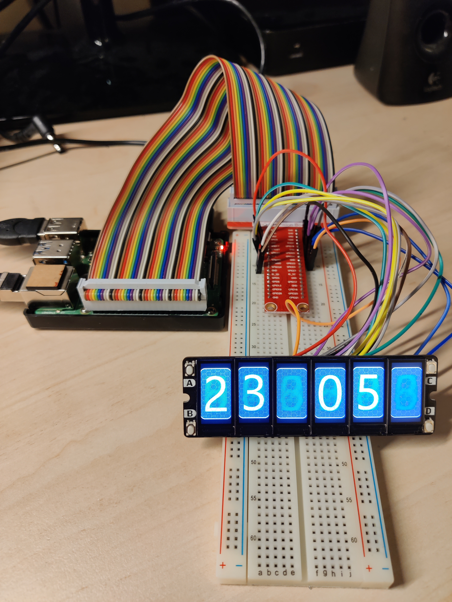

# PiClock
Raspberry Pi Clock using SPI Display Array

Display Array from Savage Electronics
https://savageelectronics.com/spi-display-array-board-clock/

Code is based on the Raspberry Pi Pico version of Savage Electronics.
Modified for Raspberry Pi and optimized.

## Main modifications
- Removed Clock configuration: No need for clock configuration, use system time synchonized by NTP
- Dynamic theming (instead of compilation time): Button A cycle trought all themes
- Add 24h mode
- Large code simplifying

## System test bench

## Pinout used
|Display     |    PI    |   PIN   |
|------------|----------|---------|
|VDD         |   3v3    |    1    |
|GND         |   Ground |    6    |
|BLK         |   GP15   |    10   |
|RST	     |   GP25   |    22   |
|D/C	     |   GP23   |    16   |
|SDI         |  SPIMOSI |    19   |
|SCK         |   SCLK   |    23   |
|BTB         |          |         |
|BTD         |          |         |
|CS1	     |   GP14   |    8    |
|CS2	     |   GP18   |    12   |
|CS3	     |   GP22   |    15   |
|CS4	     |   GP27   |    13   |
|CS5	     |   GP17   |    11   |
|CS6	     |   GP4    |    7    |
|GND         |   Ground |    20   |
|BTA         |   GP24   |    18   |
|BTC         |          |         |
