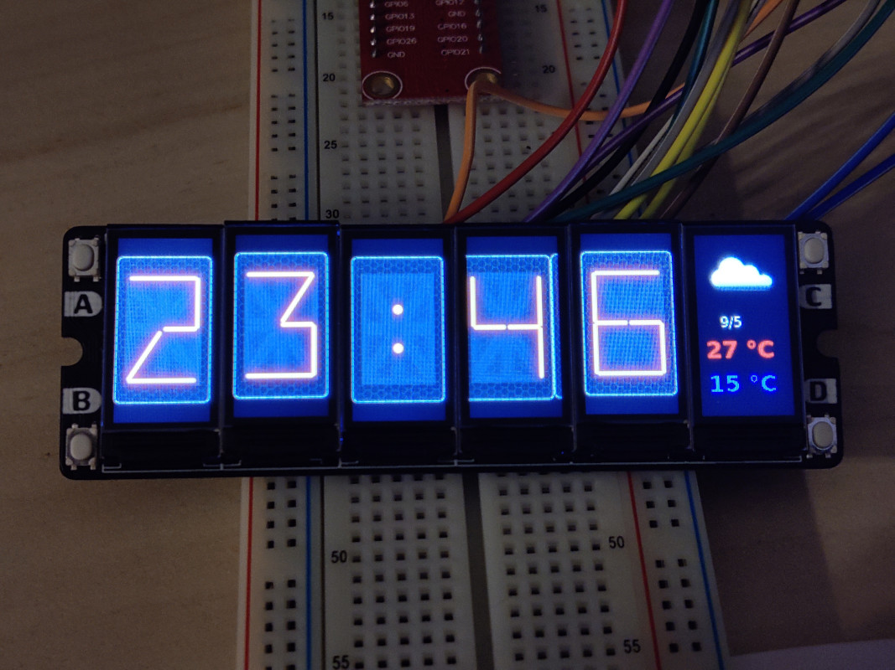
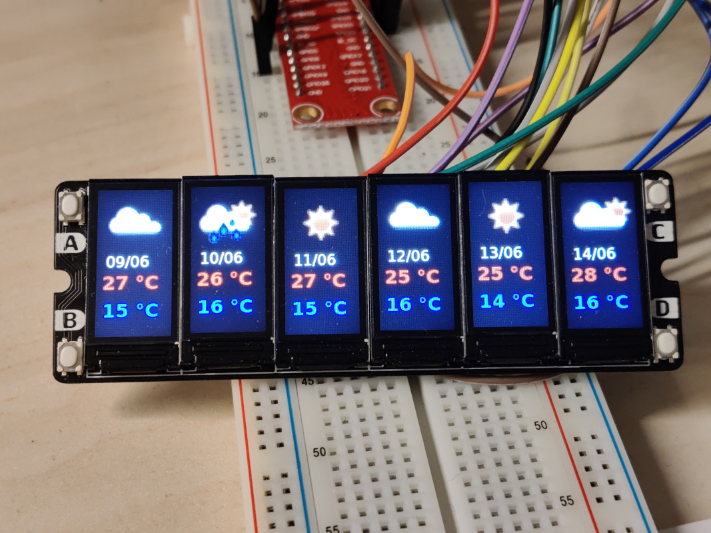

# PiClock
Raspberry Pi Clock using SPI Display Array

Display Array from Savage Electronics
https://savageelectronics.com/spi-display-array-board-clock/

Code is based on the Raspberry Pi Pico version of Savage Electronics.
Modified for Raspberry Pi and optimized.

## Main modifications
* Removed Clock configuration: No need for clock configuration, use system time synchonized by NTP
* Dynamic theming (instead of compilation time): Button A cycle trought all themes
* Add 24h mode
* Large code simplifying
* (Optional) Weather informations from OpenWeatherMap
    - Display time in 24h mode and weather forecast on display 6
    - Button B switch display Time or one display per weather forecast day

## Compilation
### Without Weather
When compiled without Weather, no QT dependency
```
mkdir build
cd build
cmake ..
make -j4
```
### With Weather (QT dev packages needed)
When compiled with Weather you need some QT dev package (qtbase5-dev)
- appID: Your own OpenWeatherMap appId
- location: OpenWeatherMap City location (ex: "Paris,FR")
```
mkdir build
cd build
cmake -DWITH_QWEATHER=ON -DOWAPPID="appID" -DOWLOCATION="location"
make -j4
```
## Running
sudo is need to access GPIO:
```
sudo ./PiClock
```

# System test bench
## Pictures
| Without Weather  |  With Weather  |
|------------------|----------------|
|||
|                  ||
## Pinout used
|Display     |    PI    |   PIN   |
|------------|----------|---------|
|VDD         |   3v3    |    1    |
|GND         |   Ground |    6    |
|BLK         |   GP15   |    10   |
|RST	     |   GP25   |    22   |
|D/C	     |   GP23   |    16   |
|SDI         |  SPIMOSI |    19   |
|SCK         |   SCLK   |    23   |
|BTB         |    GP5   |    29   |
|BTD         |          |         |
|CS1	     |   GP14   |    8    |
|CS2	     |   GP18   |    12   |
|CS3	     |   GP22   |    15   |
|CS4	     |   GP27   |    13   |
|CS5	     |   GP17   |    11   |
|CS6	     |   GP4    |    7    |
|GND         |   Ground |    20   |
|BTA         |   GP24   |    18   |
|BTC         |          |         |
